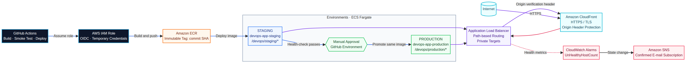

<div align="center">

# Desafio Técnico DevOps
## Lacrei Saúde

**Deploy seguro, infraestrutura reproduzível e observabilidade na AWS**

<br />


</div>

<br />

> Este projeto implementa uma aplicação Node.js/Express containerizada, executada em ECS Fargate, com deploy automatizado por GitHub Actions, autenticação OIDC, promoção controlada entre ambientes e monitoramento por CloudWatch e SNS.

## Visão geral

A solução foi construída com foco em quatro objetivos:

| Objetivo | Implementação |
|---|---|
| **Entrega segura** | GitHub Actions autenticado na AWS por OIDC, sem access keys permanentes. |
| **Rastreabilidade** | Imagens Docker identificadas pelo SHA completo do commit e armazenadas com tags imutáveis. |
| **Separação de ambientes** | Deploy em staging, validação automática e aprovação manual antes da produção. |
| **Observabilidade** | Alarmes CloudWatch baseados na saúde dos targets do ALB e notificações via SNS. |

## Resultado validado

Os dois ambientes estão publicados e respondendo corretamente pelo CloudFront:

| Ambiente | Endpoint | Status |
|---|---|---|
| **Staging** | [`/devops/staging/status`](https://d1gjy0g4ibj9zk.cloudfront.net/devops/staging/status) | `HTTP 200` |
| **Production** | [`/devops/production/status`](https://d1gjy0g4ibj9zk.cloudfront.net/devops/production/status) | `HTTP 200` |

A mesma imagem foi promovida de staging para produção:

```text
deddb239a66829abc8e75cd236671eddfec22e49
```

O monitoramento também foi validado:

- Alarmes de staging e production provisionados no CloudWatch.
- Targets saudáveis com `UnHealthyHostCount = 0`.
- Tópico SNS criado.
- Subscription de e-mail confirmada.
- Notificação de mudança de estado recebida por e-mail.

> O teste de notificação observado registrou a transição `INSUFFICIENT_DATA → OK`, confirmando a entrega do SNS ao e-mail configurado.

## Arquitetura

```mermaid
flowchart LR
    classDef cicd fill:#0f172a,stroke:#38bdf8,color:#f8fafc,stroke-width:2px
    classDef registry fill:#fff7ed,stroke:#f97316,color:#7c2d12,stroke-width:2px
    classDef staging fill:#eff6ff,stroke:#3b82f6,color:#1e3a8a,stroke-width:2px
    classDef production fill:#f0fdf4,stroke:#22c55e,color:#14532d,stroke-width:2px
    classDef network fill:#f5f3ff,stroke:#8b5cf6,color:#4c1d95,stroke-width:2px
    classDef edge fill:#ecfeff,stroke:#06b6d4,color:#164e63,stroke-width:2px
    classDef monitor fill:#fff1f2,stroke:#f43f5e,color:#881337,stroke-width:2px

    A["GitHub Actions<br/>Build · Smoke Test · Deploy"]:::cicd
    B["AWS IAM Role<br/>OIDC · Temporary Credentials"]:::cicd
    C["Amazon ECR<br/>Immutable Tag: commit SHA"]:::registry

    subgraph ENV["Environments · ECS Fargate"]
        direction TB
        D["STAGING<br/>devops-app-staging<br/>/devops/staging/*"]:::staging
        E["PRODUCTION<br/>devops-app-production<br/>/devops/production/*"]:::production
        G{{"Manual Approval<br/>GitHub Environment"}}:::production
    end

    F["Application Load Balancer<br/>Path-based Routing<br/>Private Targets"]:::network
    H["Amazon CloudFront<br/>HTTPS / TLS<br/>Origin Header Protection"]:::edge
    I[("Internet")]:::edge
    J["CloudWatch Alarms<br/>UnHealthyHostCount"]:::monitor
    K["Amazon SNS<br/>Confirmed E-mail Subscription"]:::monitor

    A -->|Assume role| B
    B -->|Build and push| C
    C -->|Deploy image| D
    D -->|Health-check passes| G
    G -->|Promote same image| E
    D --> F
    E --> F
    F -->|Origin verification header| H
    I -->|HTTPS| H
    H --> F
    F -.->|Health metrics| J
    J -->|State change| K

    style ENV fill:#f8fafc,stroke:#94a3b8,stroke-width:2px
    linkStyle 0,1,2,3,4 stroke:#2563eb,stroke-width:2px
    linkStyle 5,6,7,8 stroke:#7c3aed,stroke-width:2px
    linkStyle 9,10 stroke:#e11d48,stroke-width:2px
```



<p align="center">
  
</p>

O diagrama destaca três fluxos independentes: **entrega e promoção da imagem**, **entrada de tráfego pelo CloudFront até as tasks privadas** e **monitoramento com notificação SNS**.

### Fluxo de promoção

```text
Push na main
    ↓
Build da imagem Docker
    ↓
Smoke test HTTP
    ↓
Verificação da tag no ECR
    ↓
Push somente se a tag ainda não existir
    ↓
Deploy em staging
    ↓
Health-check de staging
    ↓
Aprovação manual no ambiente production
    ↓
Promoção da mesma imagem
    ↓
Deploy e health-check de production
```

## Componentes da solução

| Camada | Tecnologia | Responsabilidade |
|---|---|---|
| **Aplicação** | Node.js + Express | Expor as rotas da aplicação e o health-check. |
| **Container** | Docker | Empacotar a aplicação com imagem Alpine e usuário não-root. |
| **Registry** | Amazon ECR | Armazenar imagens com tags imutáveis por SHA. |
| **Computação** | ECS + Fargate | Executar os serviços sem gerenciamento de servidores. |
| **Rede** | VPC, subnets públicas e privadas | Isolar os componentes e controlar o tráfego. |
| **Entrada** | ALB + CloudFront | Roteamento por path e acesso HTTPS público. |
| **IaC** | Terraform | Provisionar e versionar a infraestrutura. |
| **CI/CD** | GitHub Actions | Automatizar build, validação e promoção. |
| **Observabilidade** | CloudWatch + SNS | Monitorar targets unhealthy e enviar alertas. |

## Aplicação

A aplicação está em `app/server.js` e possui duas rotas:

| Método | Rota | Comportamento |
|---|---|---|
| `GET` | `/` | Retorna uma identificação simples da aplicação. |
| `GET` | `/status` | Retorna status, uptime do processo e timestamp. |

Exemplo de resposta:

```json
{
  "status": "ok",
  "uptime_seconds": 315.607,
  "timestamp": "2026-09-15T02:46:44.878Z"
}
```

Nos ambientes AWS, o prefixo é configurado pela variável `APP_PREFIX`:

```text
/devops/staging/status
/devops/production/status
```

A porta da aplicação pode ser configurada pela variável `PORT`. O padrão é `3000`.

## Estrutura do repositório

```text
.
├── app/
│   ├── server.js
│   ├── package.json
│   ├── package-lock.json
│   ├── Dockerfile
│   └── .dockerignore
├── Terraform/
│   ├── backend.tf
│   ├── main.tf
│   ├── variables.tf
│   ├── outputs.tf
│   ├── iam/
│   └── modules/
│       ├── alerts/
│       ├── cloudfront/
│       ├── ecs-cluster/
│       ├── ecs-service/
│       ├── github-oidc/
│       └── network/
├── .github/
│   └── workflows/
│       └── deploy.yml
└── README.md
```

## Execução local

### Node.js

```bash
cd app
npm install
npm start
```

Em outro terminal:

```bash
curl -i http://localhost:3000/status
```

### Docker

```bash
cd app
docker build -t lacrei-status-app .
docker run --rm -p 3000:3000 lacrei-status-app
```

Validação:

```bash
curl -i http://localhost:3000/status
```

O Dockerfile utiliza `node:20-alpine`, instala as dependências com `npm ci --omit=dev`, executa o processo como usuário não-root e inclui um `HEALTHCHECK` baseado na rota `/status`.

## Infraestrutura AWS

A infraestrutura é modularizada em Terraform e utiliza:

- VPC dedicada com CIDR `10.20.0.0/16`.
- Duas subnets públicas e duas subnets privadas.
- NAT Gateway único para reduzir o custo do ambiente de portfólio.
- ECS Cluster com Container Insights habilitado.
- Serviços Fargate separados para staging e production.
- ALB com roteamento por path.
- ECR com `IMMUTABLE` tags.
- CloudFront com HTTPS obrigatório.
- Security groups em camadas.
- IAM Role para GitHub Actions via OIDC.
- CloudWatch Alarms e SNS.

As tasks Fargate executam em subnets privadas, sem IP público. O tráfego permitido para as tasks é originado somente pelo security group do ALB.

### Backend do Terraform

O state é armazenado remotamente no S3:

```text
Bucket: lacrei-desafio-terraform-state
Key:    lacrei-desafio/terraform.tfstate
Region: us-east-1
Lock:   arquivo de lock nativo do backend S3
```

## GitHub Actions

O workflow está em:

```text
.github/workflows/deploy.yml
```

Ele é acionado por push na branch `main` quando há alterações em:

```text
app/**
Terraform/**
.github/workflows/deploy.yml
```

### Segurança

O pipeline usa GitHub Actions OIDC para assumir uma IAM Role temporária na AWS. Não são utilizadas access keys permanentes armazenadas como secrets.

### Tags imutáveis

A imagem recebe uma tag baseada no SHA do commit:

```yaml
IMAGE_TAG: ${{ github.sha }}
```

Antes do push, o workflow verifica se a tag já existe no ECR. Isso permite reexecutar um pipeline sem tentar sobrescrever uma tag imutável que já foi publicada.

### Secrets necessários

Configure em **Settings → Secrets and variables → Actions**:

| Secret | Finalidade |
|---|---|
| `AWS_ROLE_ARN` | ARN da IAM Role assumida pelo GitHub Actions via OIDC. |
| `ALERT_EMAIL` | E-mail utilizado pela subscription do SNS. |

O ambiente `production` deve possuir aprovação manual configurada por meio de um required reviewer.

## Operação do Terraform

Execute os comandos dentro da pasta `Terraform`:

```bash
cd Terraform
AWS_PROFILE=lacrei-desafio terraform init
AWS_PROFILE=lacrei-desafio terraform plan
AWS_PROFILE=lacrei-desafio terraform apply
```

Consulte as URLs publicadas:

```bash
AWS_PROFILE=lacrei-desafio terraform output
```

Não utilize `-lock=false` para contornar um lock. Antes de usar `force-unlock`, confirme que não existe outro `terraform plan`, `terraform apply` ou workflow ativo usando o mesmo state remoto.

## Monitoramento e alertas

Existe um alarme por ambiente para a métrica:

```text
AWS/ApplicationELB/UnHealthyHostCount
```

Configuração principal:

| Parâmetro | Valor |
|---|---|
| Período | 60 segundos |
| Períodos de avaliação | 2 |
| Estatística | Maximum |
| Limite | `>= 1` target unhealthy |
| Ação | Publicação no SNS |
| Dados ausentes | `missing` |

Consultar os alarmes:

```bash
AWS_PROFILE=lacrei-desafio aws cloudwatch describe-alarms \
  --alarm-name-prefix lacrei-desafio \
  --region us-east-1 \
  --query 'MetricAlarms[*].[AlarmName,StateValue,StateReason]' \
  --output table
```

Consultar a subscription do SNS:

```bash
AWS_PROFILE=lacrei-desafio aws sns list-subscriptions-by-topic \
  --topic-arn arn:aws:sns:us-east-1:905542450009:lacrei-desafio-alerts \
  --region us-east-1 \
  --query 'Subscriptions[*].[Protocol,Endpoint,SubscriptionArn]' \
  --output table
```

A subscription de e-mail precisa ser confirmada pelo link enviado pela AWS. Enquanto não for confirmada, seu ARN aparece como `PendingConfirmation` e as notificações não são entregues.

## Limpeza da infraestrutura

Os recursos AWS geram custos enquanto permanecem ativos. Para remover a infraestrutura provisionada por este state:

```bash
cd Terraform
AWS_PROFILE=lacrei-desafio terraform plan -destroy
AWS_PROFILE=lacrei-desafio terraform destroy
```

Revise o plano antes de confirmar a destruição.

<div align="center">

**Desafio Técnico DevOps — Lacrei Saúde**

</div>
