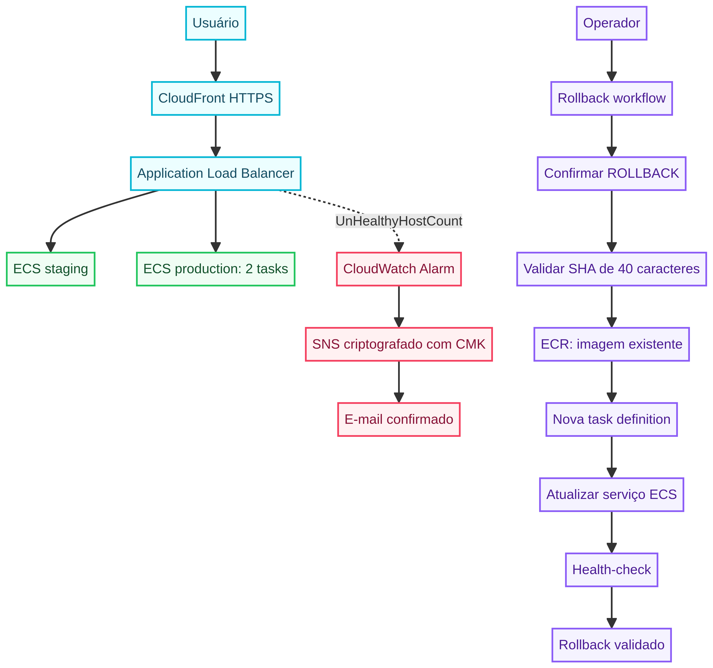
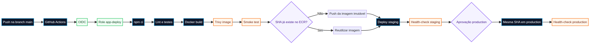
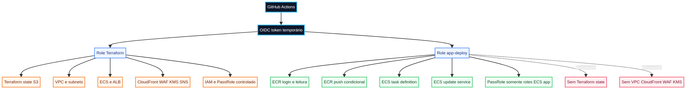

# Desafio Técnico DevOps — Lacrei Saúde

## Como ler esta apresentação

Esta página explica a solução do ponto de vista de quem precisa entender **o que foi construído, por que cada componente existe e como os componentes trabalham juntos**. A sequência segue o caminho natural do projeto: aplicação, infraestrutura, segurança, entrega, operação e rollback.

> **Mensagem principal:** a aplicação é simples, mas o processo de entrega foi tratado como um sistema de produção. O código é validado antes do build, a imagem é identificada por uma SHA imutável, staging é validado antes de production e uma versão anterior pode ser reaplicada sem novo build.

---

## 1. Resumo executivo

Este projeto implementa uma aplicação Node.js/Express executada em Amazon ECS Fargate. A infraestrutura é criada com Terraform. O GitHub Actions executa lint, testes, build Docker, análise de segurança, publicação no ECR e atualização dos serviços ECS.

A solução foi organizada em dois ambientes:

| Ambiente | Objetivo | Capacidade |
|---|---|---|
| Staging | Validar a versão antes da promoção | 1 task Fargate |
| Production | Atender o tráfego final com redundância | 2 tasks Fargate |

O usuário acessa o sistema pelo CloudFront usando HTTPS. O CloudFront encaminha o tráfego para o Application Load Balancer, que roteia a requisição pelo caminho da URL até o serviço ECS correspondente.

### Resultado final

- Staging respondeu com `HTTP 200`.
- Production respondeu com `HTTP 200`.
- A mesma imagem foi promovida entre os ambientes.
- O rollback por SHA foi executado com sucesso em staging.
- O e-mail do SNS foi confirmado e recebeu notificação.
- A role de deploy foi separada da role de infraestrutura.

---

## 2. Visão geral da arquitetura


### O que cada camada faz

**Internet:** representa o usuário ou cliente que acessa a aplicação.

**CloudFront:** é o ponto público de entrada. Entrega HTTPS, aceita somente `GET` e `HEAD` e envia um header secreto ao origin para reduzir o acesso direto ao ALB.

**Application Load Balancer:** recebe o tráfego do CloudFront e escolhe o ambiente com base no path da URL.

**ECS Fargate:** executa os containers sem que seja necessário administrar servidores. Staging e production possuem serviços separados.

**ECR:** armazena as imagens Docker. As tags usam o SHA completo do commit e são imutáveis.

**GitHub Actions:** executa o pipeline de qualidade, segurança, publicação e deploy.

**CloudWatch e SNS:** observam a saúde dos targets do ALB e enviam um alerta por e-mail quando necessário.

---

## 3. Fluxo de uma requisição



### Passo 1 — O usuário acessa uma URL HTTPS

Os endpoints publicados são:

```text
https://d1gjy0g4ibj9zk.cloudfront.net/devops/staging/status
https://d1gjy0g4ibj9zk.cloudfront.net/devops/production/status
```

O CloudFront é responsável pelo acesso público e redireciona requisições HTTP para HTTPS.

### Passo 2 — CloudFront encaminha a requisição ao ALB

O CloudFront envia um header secreto configurado pelo Terraform. O listener do ALB exige esse header. A finalidade é reduzir o risco de que alguém ignore o CloudFront e tente usar o ALB diretamente.

> Esta proteção reduz o bypass direto, mas não substitui um ALB privado. A configuração foi escolhida porque o ALB funciona como origin da distribuição CloudFront.

### Passo 3 — O ALB aplica o roteamento por path

As regras são:

```text
/devops/staging/*    → serviço ECS staging
/devops/production/* → serviço ECS production
```

### Passo 4 — O serviço ECS encaminha para uma task saudável

As tasks ficam em subnets privadas e não recebem IP público. O Security Group da aplicação aceita tráfego somente do Security Group do ALB.

### Passo 5 — A aplicação responde

A rota `/status` retorna JSON com o estado da aplicação, o uptime do processo e o timestamp atual.

```json
{
  "status": "ok",
  "uptime_seconds": 315.607,
  "timestamp": "2026-09-15T02:46:44.878Z"
}
```

---

## 4. Como uma mudança vira uma versão publicada



### Passo 1 — O desenvolvedor envia uma alteração

O workflow `deploy.yml` é acionado por alterações na aplicação, nos scripts ou no próprio workflow de deploy na branch `main`.

### Passo 2 — GitHub Actions autentica na AWS com OIDC

O GitHub fornece um token de identidade temporário. A AWS valida esse token por meio da trust policy da IAM Role. Não é necessário armazenar access keys permanentes no GitHub.

### Passo 3 — O código é validado

O pipeline executa:

```text
npm ci
npm run lint
npm test
```

O lint verifica problemas de estilo e estrutura. Os testes Jest/Supertest validam as rotas e respostas principais.

Se essa etapa falhar, o pipeline é interrompido antes da criação da imagem.

### Passo 4 — A imagem Docker é criada

A imagem utiliza Node.js Alpine, instala somente dependências de runtime e executa o processo como usuário não-root.

A tag da imagem é a SHA completa do commit:

```text
${{ github.sha }}
```

Essa tag permite responder a duas perguntas importantes:

1. Qual commit gerou esta imagem?
2. Qual imagem deve ser reaplicada em um rollback?

### Passo 5 — A imagem é analisada pelo Trivy

O Trivy examina a imagem para vulnerabilidades `HIGH` e `CRITICAL`. O pipeline falha quando encontra um problema bloqueante conforme a política configurada.

### Passo 6 — O container passa pelo smoke test

O pipeline inicia o container localmente e chama:

```text
http://localhost:3000/devops/staging/status
```

Esse teste verifica se a imagem inicia e se a aplicação responde antes da publicação no ECR.

### Passo 7 — A imagem é publicada de forma idempotente

O workflow consulta o ECR antes do push. Se a tag já existe, a imagem é reutilizada. Essa decisão é necessária porque o ECR está configurado com tags imutáveis e não permite sobrescrever uma tag existente.

### Passo 8 — Staging é atualizado

O script `scripts/deploy-ecs.sh`:

1. Lê a task definition atual.
2. Substitui a imagem pelo novo URI.
3. Registra uma nova revision.
4. Atualiza o serviço ECS.
5. Aguarda o serviço ficar estável.

### Passo 9 — Staging é validado

O workflow chama a URL de staging até que ela responda com sucesso. Se a validação falhar, production não é promovido.

### Passo 10 — Production exige aprovação

O job `promote-to-production` usa o GitHub Environment `production`. O required reviewer cria uma barreira operacional antes da promoção.

### Passo 11 — A mesma imagem é promovida

Production recebe a mesma SHA que passou por staging. Não existe um novo build para production.

Essa é uma decisão importante de rastreabilidade: o artefato testado é o mesmo artefato publicado.

---

## 5. Separação de IAM e Least Privilege



### Por que existem duas roles?

Terraform e deploy possuem responsabilidades diferentes. Misturar os dois poderes em uma única role faria com que o pipeline da aplicação pudesse alterar toda a infraestrutura.

### Role de infraestrutura

A role `lacrei-desafio-github-actions` é utilizada por `infrastructure.yml`. Ela é mais ampla porque precisa criar ou alterar recursos como:

- VPC e subnets;
- ECS e ALB;
- CloudFront e WAF;
- KMS e SNS;
- CloudWatch;
- IAM;
- state remoto do Terraform.

### Role de aplicação

A role `lacrei-desafio-app-deploy` é utilizada por `deploy.yml` e `rollback.yml`. Ela pode atuar no ECR e nos serviços ECS da aplicação, mas não possui acesso ao state Terraform nem às operações de VPC, CloudFront, WAF ou KMS.

A permissão `iam:PassRole` é restrita às roles de execução ECS da aplicação.

### O que o OIDC protege

OIDC substitui access keys permanentes por credenciais temporárias. A trust policy ainda limita:

- o repositório autorizado;
- os IDs imutáveis do proprietário e do repositório;
- a branch `main`;
- os GitHub Environments `staging` e `production`.

> **Least privilege não significa que toda role tenha poucas permissões.** A role Terraform precisa ser ampla por causa da sua responsabilidade. O ponto essencial é que a role de deploy, usada com maior frequência, não tenha poderes de infraestrutura.

---

## 6. Segurança da aplicação e da infraestrutura

### Segurança da aplicação

- Imagem baseada em Node.js Alpine.
- Dependências de produção instaladas com `npm ci --omit=dev`.
- Processo executado como usuário não-root.
- `HEALTHCHECK` configurado no Dockerfile.
- Lint e testes executados antes do build.
- Trivy aplicado à imagem.

### Segurança da rede

- Tasks sem IP público.
- Tasks em subnets privadas.
- Security Group da aplicação aceita tráfego somente do ALB.
- CloudFront expõe HTTPS aos usuários.
- WAF associado ao CloudFront.
- Métodos CloudFront limitados a `GET` e `HEAD`.
- Header secreto entre CloudFront e ALB.

### Segurança do Terraform

- State remoto no S3.
- State criptografado.
- Lock nativo do backend.
- `terraform fmt` e `terraform validate` no pipeline.
- Trivy aplicado à configuração Terraform.
- Secrets fornecidos por variáveis de ambiente ou GitHub Secrets.

### Limitações conhecidas

O origin CloudFront → ALB utiliza HTTP porque o ALB usa o domínio padrão da AWS e não possui certificado ACM associado a um domínio próprio nesta entrega. Em uma arquitetura produtiva com domínio controlado, a alternativa recomendada é habilitar HTTPS no ALB e usar `origin_protocol_policy = "https-only"`.

O projeto utiliza um NAT Gateway único para reduzir custos. Production possui duas tasks em Availability Zones distintas, mas a saída das subnets privadas não possui redundância completa de NAT.

---

## 7. Monitoramento e alertas

O CloudWatch acompanha a métrica:

```text
AWS/ApplicationELB/UnHealthyHostCount
```

Há um alarme para cada ambiente. A configuração principal é:

| Configuração | Valor |
|---|---|
| Período | 60 segundos |
| Períodos de avaliação | 2 |
| Estatística | `Maximum` |
| Limite | `>= 1` target unhealthy |
| Dados ausentes | `breaching` |
| Destino | SNS |

### Por que `breaching` é importante?

Sem essa configuração, a ausência de dados poderia resultar em `INSUFFICIENT_DATA` sem disparar um alerta claro. Ao tratar dados ausentes como condição de violação, o monitoramento fica mais conservador diante de uma possível indisponibilidade.

### Caminho do alerta

```text
Target ECS unhealthy
        ↓
Métrica do ALB
        ↓
Alarme CloudWatch
        ↓
Tópico SNS criptografado com CMK
        ↓
E-mail confirmado
```

A subscription de e-mail foi confirmada e recebeu uma notificação de mudança de estado.

---

## 8. Rollback por SHA

O rollback foi desenhado para não depender de rebuild. Ele reaplica uma imagem que já existe no ECR.

### Fluxo visual


### Passo a passo

1. O operador identifica uma SHA estável existente no ECR.
2. Abre `Actions → Rollback DevOps App → Run workflow`.
3. Escolhe `staging` ou `production`.
4. Informa a SHA de 40 caracteres.
5. Digita `ROLLBACK` como confirmação.
6. O workflow verifica o formato da SHA.
7. O workflow confirma que a imagem existe no ECR.
8. O script registra uma nova task definition apontando para a imagem antiga.
9. O serviço ECS é atualizado e aguarda estabilidade.
10. O endpoint do ambiente é validado.

### Evidência

O fluxo foi validado com sucesso:

```text
Run: 35309972742
Ambiente: staging
Resultado: sucesso
```

### Por que o rollback usa imagem e não somente revision ECS?

A imagem SHA identifica diretamente o artefato da aplicação. Isso torna o procedimento explícito e reproduzível. A revision ECS ainda pode ser usada como procedimento emergencial direto, mas o workflow por SHA é o caminho operacional padronizado.

---

## 9. Erros encontrados e o que eles ensinaram

| Erro encontrado | Causa | Aprendizado |
|---|---|---|
| Push repetido em tag ECR | A mesma SHA já havia sido publicada. | Pipelines precisam ser idempotentes quando usam tags imutáveis. |
| Falha de lint no CI | A configuração ESLint estava fora do diretório `app`. | A configuração deve acompanhar o `package.json` e o código que ela valida. |
| Falha OIDC no rollback | GitHub Environment altera o `sub` do token. | A trust policy precisa cobrir branch e Environment. |
| Script ECS sem execução | O bit executável não estava garantido. | Scripts chamados diretamente pelo CI devem ser versionados como executáveis. |
| Permissões ausentes para WAF/KMS | A role Terraform não tinha as ações dos novos recursos. | Least privilege exige ajustar a role conforme o escopo real, sem ampliar a role de deploy. |
| Lock Terraform persistente | Execução interrompida deixou o state bloqueado. | Lock não deve ser ignorado sem verificar processos ativos. |
| URL malformada no health-check | O nome da variável foi incluído dentro do valor. | Variables devem armazenar apenas o valor, e o workflow deve validar o formato. |
| Placeholder usado no rollback | Foi informado texto em vez de uma SHA real. | Inputs operacionais devem ser validados antes de acessar a infraestrutura. |

---

## 10. Checklist final para o PO

| Ponto solicitado | Evidência |
|---|---|
| Least privilege IAM | Roles separadas e `iam:PassRole` limitado. |
| Terraform separado do deploy | `infrastructure.yml` executa Terraform; `deploy.yml` não executa Terraform. |
| Lint e testes | `npm run lint` e `npm test` antes do Docker build. |
| Trivy | Scan Terraform e scan da imagem. |
| Alta disponibilidade | Duas tasks em production. |
| CloudFront restrito | HTTPS e somente `GET`/`HEAD`. |
| Alertas | CloudWatch → SNS → e-mail confirmado. |
| Dados ausentes | `treat_missing_data = "breaching"`. |
| Rollback | Workflow por SHA existente no ECR. |
| Rollback comprovado | Run `35309972742` com sucesso. |
| Documentação de decisões | Seção de erros, limitações e decisões técnicas. |
| Checklist de segurança | Seção explícita no README. |

---

## 11. Roteiro de fala para a entrevista

### Abertura

> “Eu tratei o desafio como uma entrega de produção em pequena escala. A aplicação é simples, mas o objetivo foi demonstrar controle sobre segurança, rastreabilidade, infraestrutura e operação.”

### Arquitetura

> “O usuário entra pelo CloudFront usando HTTPS. O CloudFront encaminha para o ALB com um header de verificação. O ALB roteia pelo path para serviços ECS separados. As tasks ficam em subnets privadas e production mantém duas réplicas.”

### CI/CD

> “Antes de publicar, o pipeline instala dependências, executa lint e testes, constrói a imagem, roda Trivy e faz um smoke test. A imagem recebe a SHA do commit como tag imutável. Depois ela é publicada ou reutilizada no ECR, implantada em staging e somente após o health-check e a aprovação é promovida para production.”

### IAM

> “A decisão mais importante de segurança foi separar a role Terraform da role de aplicação. Terraform precisa de permissões amplas para provisionar a plataforma. O deploy não precisa delas. Por isso a role de deploy acessa somente ECR, ECS e as roles ECS permitidas por `iam:PassRole`.”

### Observabilidade

> “O CloudWatch acompanha targets unhealthy do ALB. Se houver pelo menos um target unhealthy por dois períodos, o alarme publica no SNS. O tópico usa uma CMK dedicada e a subscription foi confirmada e testada.”

### Rollback

> “O rollback não recompila a aplicação. O operador escolhe uma SHA estável já existente no ECR. O workflow valida a imagem, registra uma nova task definition e atualiza o serviço. Esse processo foi executado com sucesso em staging.”

### Limitações

> “Eu também documentei as limitações. O origin CloudFront para ALB usa HTTP nesta entrega porque não há domínio próprio com certificado ACM. Além disso, foi usado um NAT Gateway único para controlar custos. Production possui duas tasks, mas a saída da VPC não tem redundância completa de NAT.”

### Encerramento

> “O resultado é uma solução reproduzível, rastreável e operável. O principal ganho não é apenas subir a aplicação, mas conseguir explicar quem pode alterar cada camada, como uma versão é promovida e como ela pode ser recuperada com segurança.”

---

## Referências técnicas

[1]: https://docs.github.com/en/actions/deployment/security-hardening-your-deployments/about-security-hardening-with-openid-connect "GitHub Actions OpenID Connect"
[2]: https://docs.aws.amazon.com/IAM/latest/UserGuide/id_roles_providers_create_oidc.html "AWS IAM OIDC identity providers"
[3]: https://docs.aws.amazon.com/AmazonECS/latest/developerguide/task_definition_parameters.html "Amazon ECS task definition parameters"
[4]: https://developer.hashicorp.com/terraform/language/backend/s3 "Terraform S3 backend"
[5]: https://aquasecurity.github.io/trivy/latest/docs/ "Trivy documentation"
